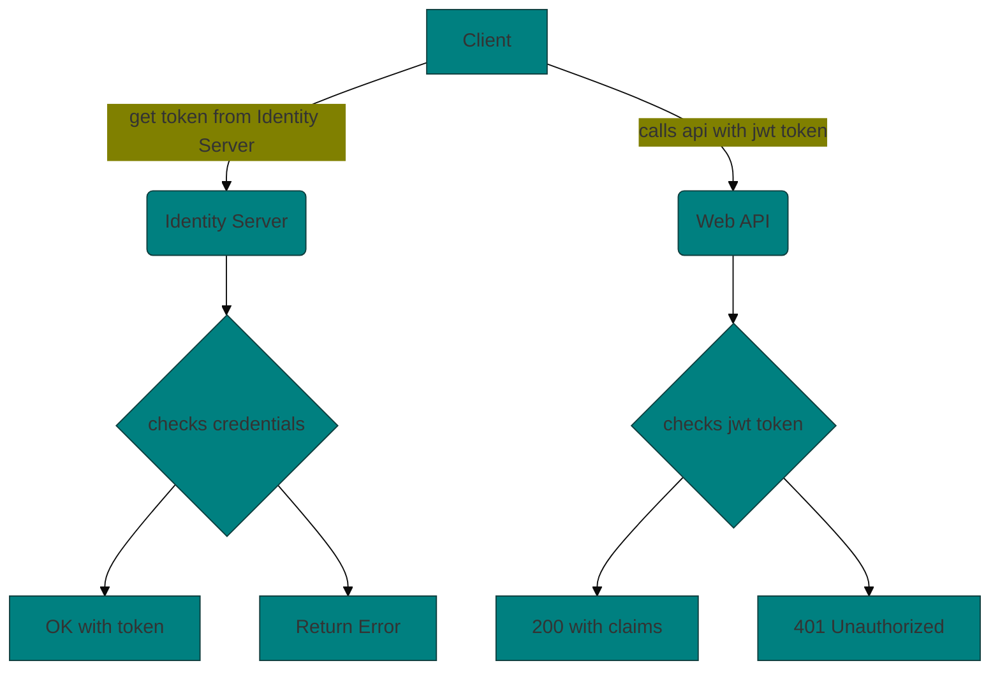
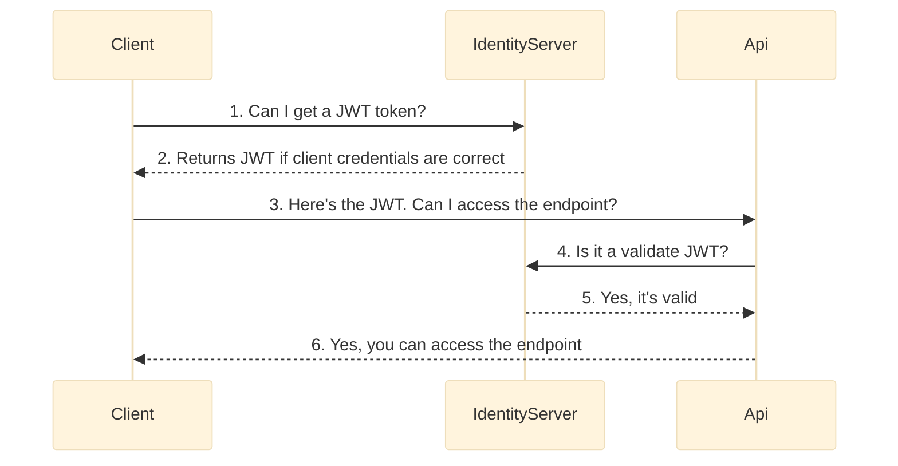

# Identity Server Example
IdentityServer4 is an OpenID Connect and OAuth 2.0 framework for ASP.NET Core.

### IdentityServer:
IdentityServer is an OpenID Connect provider - it implements the OpenID Connect and OAuth 2.0 protocols.

Different literature uses different terms for the same role - you probably also find security token service, identity provider, authorization server, IP-STS and more.

But they are in a nutshell all the same: a piece of software that issues security tokens to clients.
### User:
A user is a human that is using a registered client to access resources.

### Client:
A client is a piece of software that requests tokens from IdentityServer - either for authenticating a user (requesting an identity token) or for accessing a resource (requesting an access token). A client must be first registered with IdentityServer before it can request tokens.

Examples for clients are web applications, native mobile or desktop applications, SPAs, server processes etc.

### Resources
Resources are something you want to protect with IdentityServer - either identity data of your users, or APIs.

Every resource has a unique name - and clients use this name to specify to which resources they want to get access to.

Identity data Identity information (aka claims) about a user, e.g. name or email address.

APIs APIs resources represent functionality a client wants to invoke - typically modelled as Web APIs, but not necessarily.
### Identity Token
An identity token represents the outcome of an authentication process. It contains at a bare minimum an identifier for the user (called the sub aka subject claim) and information about how and when the user authenticated. It can contain additional identity data.

### Access Token
An access token allows access to an API resource. Clients request access tokens and forward them to the API. Access tokens contain information about the client and the user (if present). APIs use that information to authorize access to their data.

---
## Useful Links:
- [IdentityServer4](https://identityserver.io/)
- [IdentityServer4 Doc](http://docs.identityserver.io/en/latest/index.html)
---

---

